# Chapter House Literary Agency

Chapter House Literary Agency is a static front-end website for a fictional literary agency. The project was created as part of the Level 5 Diploma in Web Application Development and is designed to present a clear, professional, and responsive experience for authors seeking representation 

**Live site:** [Chapter House Literary Agency](https://zsheerani1.github.io/chapter-house-literary-agency/)  
**Repository:** [GitHub Repository](https://github.com/zsheerani1/chapter-house-literary-agency)

---

## Contents

- [Project Overview](#project-overview)
- [User Experience](#user-experience)
- [Design](#design)
- [Features](#features)
- [Technologies Used](#technologies-used)
- [Testing](#testing)
- [Deployment](#deployment)
- [Credits](#credits)

---

## Project Overview

Chapter House Literary Agency is a three-page front-end website for a fictional literary agency. It was developed using HTML5 and CSS3 to provide aspiring and established authors with essential information about the agency, including its editorial interests, submission requirements, and overall identity.

The aim of the project is to create a visually polished and accessible website that communicates trust, clarity, and literary professionalism. The site is structured to help users quickly determine whether their work is suitable for submission and how to prepare a query.

---

## User Experience

### Project Goals

The main goal of the site is to provide a clear and engaging online presence for a fictional literary agency. The website is intended to:
- Communicate the agency’s identity and editorial values.
- Help prospective authors determine whether their work is a good fit.
- Present submission guidance in a straightforward and accessible format.
- Deliver a responsive experience across desktop, tablet, and mobile devices.

### User Stories

### User Story: Understand what the agency represents

- As a first-time visitor, I want to understand what the agency represents so that I can decide whether it is relevant to me.

The homepage introduces the agency's editorial focus through a dedicated "What we represent" section, helping visitors quickly understand the genres and literary areas the agency is interested in.

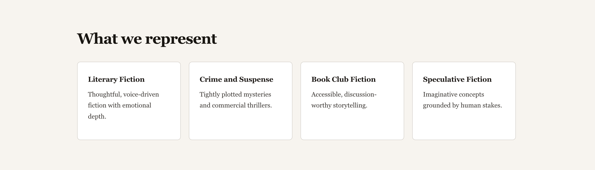

### User Story: Genre and suitability guidance

- As a writer seeking representation, I want to know what genres the agency is interested in so that I do not waste time submitting unsuitable work.

The website helps potential submitters assess whether their work is a good fit by outlining the qualities and editorial criteria the agency looks for, including distinctive voice, strong concept, emotional depth, and market awareness.

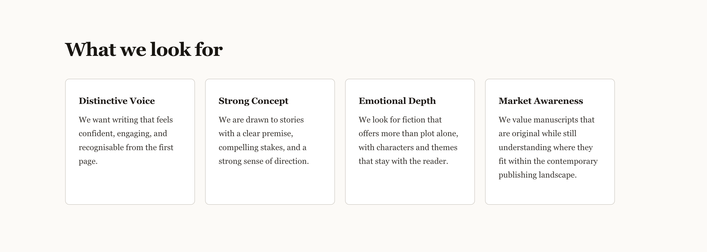

### User Story: Mobile accessibility and responsive layout

As a mobile user, I want the site to remain clear, readable, and easy to navigate on a smaller screen.  
As a mobile user, I want the key content and navigation to work without layout issues so that I can access information on the go.

The homepage was tested in a mobile viewport to confirm that the layout remains readable and functional on smaller screens. The screenshot below shows that the navigation, heading structure, body text, call-to-action button, and featured image all adapt clearly within a mobile screen width without overlapping or breaking the layout.

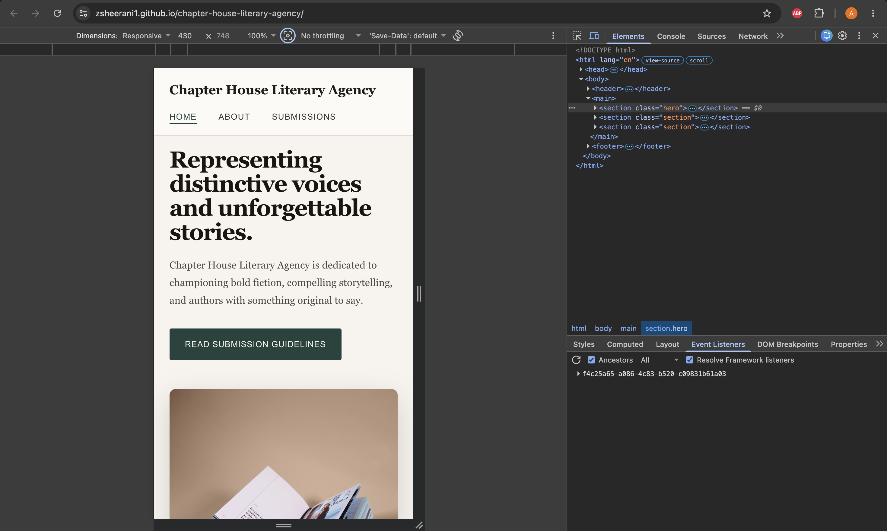

### Site Owner Goals

- Present the agency as selective, credible, and professional.
- Encourage high-quality submissions by explaining expectations clearly.
- Reduce unsuitable queries by outlining genre interests and submission requirements.
- Build trust through a consistent visual identity and usable interface.

---
## Design

### Colour Scheme

The site uses a muted editorial colour palette designed to reflect the tone of a literary agency. Warm off-white backgrounds create a soft reading surface, dark brown-charcoal text provides strong readability, and deep green accents are used to highlight navigation states, buttons, and form focus styles.

| Purpose | Hex Code | Use |
|---|---|---|
| Main page background | `#f7f4ee` | Body background |
| Secondary background | `#fcfaf6` | Header and alternating sections |
| Primary text | `#1f1a17` | Main body text and site title |
| Heading text | `#1a1612` | Main headings |
| Secondary text | `#3a3530` | Paragraphs, labels, navigation text |
| Supporting text | `#4e4842` | Hero paragraph text |
| Primary accent | `#23443c` | Buttons, active navigation, focus border |
| Accent hover | `#1a312b` | Button hover and focus states |
| Card background | `#ffffff` | Content cards and form fields |
| Border colour | `#d4cfc8` | Card borders |
| Soft divider | `#e0d8cd` | Header border, list dividers, section borders |
| Input border | `#c5bdb1` | Form field borders |
| Footer background | `#1a2e28` | Footer background |
| Footer text | `#b8ccc8` | Footer text colour |

This palette was chosen to create a calm and literary visual identity. The off-white backgrounds soften the interface, the dark text ensures comfortable long-form reading, and the muted green provides contrast without making the site feel overly corporate or modern.

### Typography

The typography was designed to balance literary character with usability. Serif typefaces were used for the main content to give the site a more editorial and traditional publishing tone, while sans-serif fonts were used for navigation and interface elements to improve clarity and contrast.

#### Font Families

- **Primary content font:** `Georgia, "Times New Roman", serif`
- **Navigation and interface font:** `Arial, Helvetica, sans-serif`

#### Typography Usage

| Element | Font Family | Styling |
|---|---|---|
| Body text | `Georgia, "Times New Roman", serif` | Main reading font with `line-height: 1.7` |
| Site title | `Georgia, "Times New Roman", serif` | `1.35rem`, bold |
| Hero heading (`h1`) | `Georgia, "Times New Roman", serif` | `clamp(2.4rem, 5vw, 3.8rem)`, tight line-height, negative letter spacing |
| Section headings (`h2`) | `Georgia, "Times New Roman", serif` | `clamp(1.7rem, 3vw, 2.3rem)` |
| Card headings (`h3`) | `Georgia, "Times New Roman", serif` | `1.1rem`, bold |
| Navigation links | `Arial, Helvetica, sans-serif` | `0.875rem`, uppercase, letter-spaced |
| Buttons | `Arial, Helvetica, sans-serif` | `0.875rem`, uppercase, letter-spaced |
| Form labels | `Arial, Helvetica, sans-serif` | `0.875rem`, clean interface text |
| Footer text | `Georgia, "Times New Roman", serif` | `0.875rem` |

#### Typography Rationale

Georgia was selected as the main content typeface because it is a serif font designed for comfortable on-screen reading and suits a content-led, editorial-style website. Its traditional appearance supports the literary identity of the fictional agency while remaining readable across different screen sizes.

Arial was used for navigation, buttons, and labels to provide contrast against the serif body type and to keep interface elements crisp and easy to scan. This works especially well for short uppercase navigation labels and calls to action, where a sans-serif typeface improves clarity.

The typography hierarchy was reinforced through font size, spacing, and contrast rather than using many different fonts. Large serif headings establish tone, body copy remains readable through generous line-height, and smaller sans-serif interface text helps users distinguish navigation and actions from content.

### Imagery

The homepage uses book-related photography to support the literary identity of the project. The images were chosen to create an atmosphere that feels thoughtful, editorial, and professional, matching the tone established by the palette and typography.

### Wireframes

Wireframes were created during the planning stage to map the structure and hierarchy of each page before development began.

#### Index page wireframe
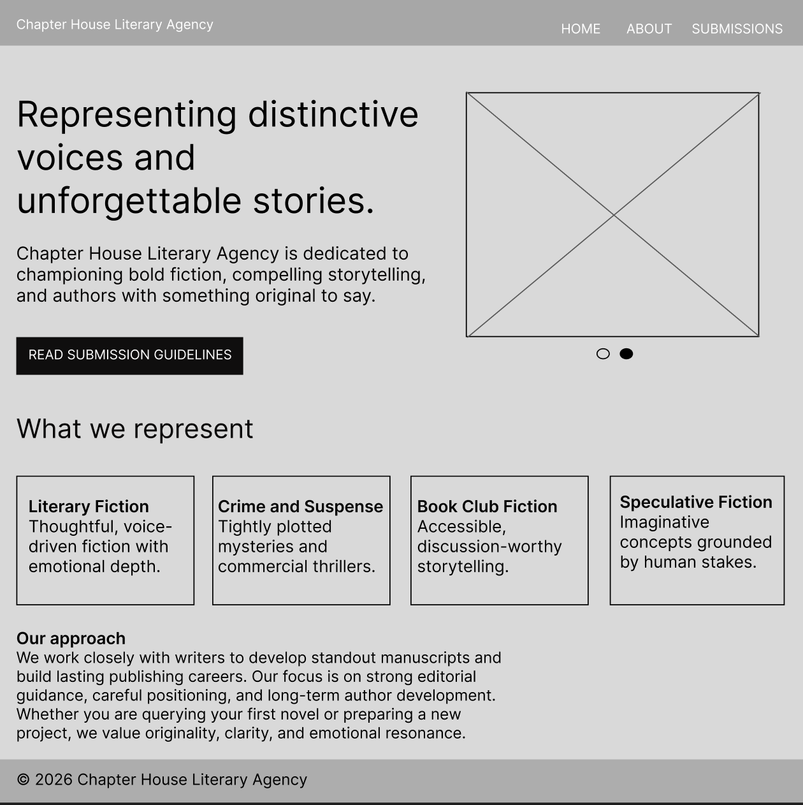

#### About page wireframe
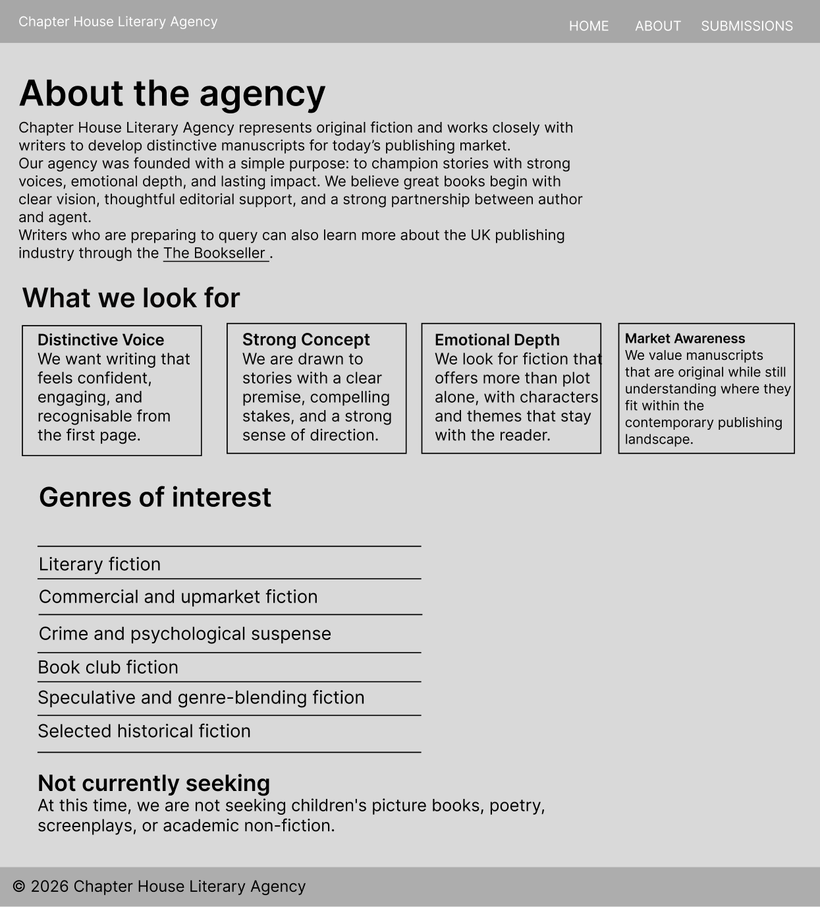

#### Submissions page wireframe
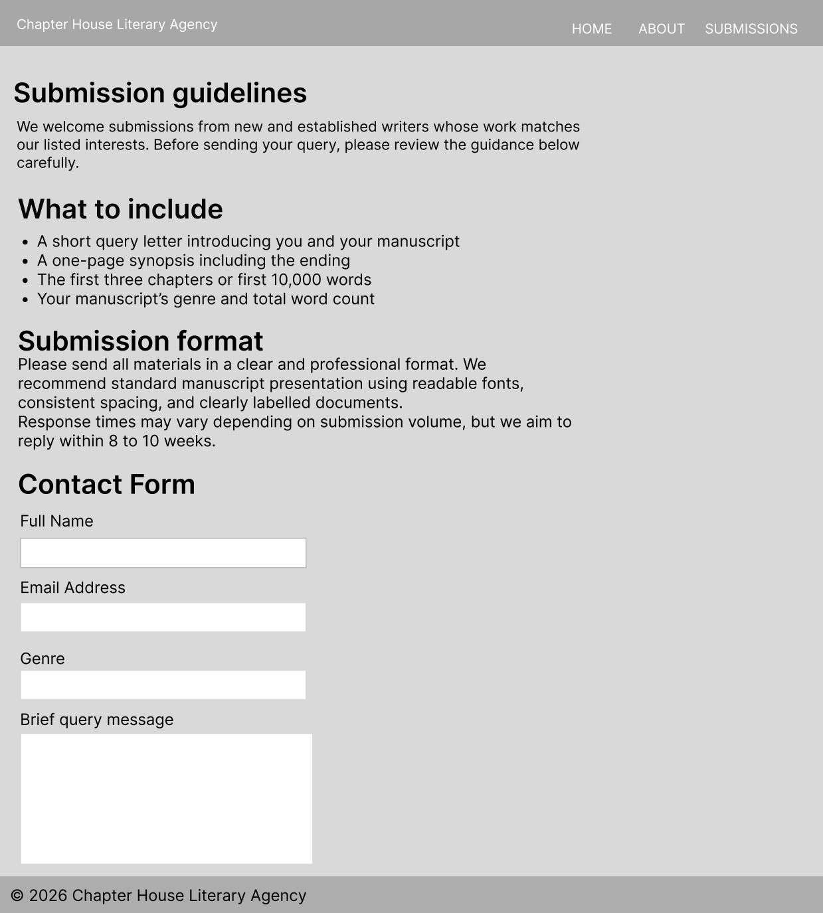

---

## Features

### Existing Features

#### Navigation Bar
- A consistent navigation bar appears across all pages.
- The current page is indicated with an active underline state.
- The layout remains usable across screen sizes.

#### Homepage Hero Section
- The homepage introduces the agency with a strong literary-focused headline and supporting copy.
- A pure CSS slideshow provides visual interest without requiring JavaScript.

#### Genre and Agency Information
- Content cards are used to present genres, editorial qualities, and submission-related details in a structured way.
- The card layout adapts across responsive breakpoints.

#### Submissions Guidance
- The submissions page explains what materials authors should send and how those materials should be formatted.
- Information is grouped into clearly labelled sections for ease of use.

#### Contact Form
- The site includes a labelled submission contact form.
- Form fields have visible focus states to support keyboard navigation and accessibility.

#### Footer
- A consistent footer appears throughout the site.
- It reinforces the branding and completes the page structure.


---

## Technologies Used

### Languages

- HTML5
- CSS3

### CSS Techniques

- CSS Grid
- Flexbox
- Custom properties
- `clamp()` for fluid typography
- Keyframe animation for the slideshow
- Media queries for responsive design

### Tools and Platforms

- Git for version control
- GitHub for repository hosting
- GitHub Pages for deployment
- Figma for wireframing
- Chrome DevTools for responsive testing and Lighthouse audits
- W3C HTML Validator
- W3C CSS Validator

---

## Testing

### Manual Testing

| Feature | Expected Outcome | Result |
|---|---|---|
| Home nav link | Navigates to `index.html` | Pass |
| About nav link | Navigates to `about.html` | Pass |
| Submissions nav link | Navigates to `submissions.html` | Pass |
| Active nav state | Current page link is visually highlighted | Pass |
| Slideshow | Images transition automatically | Pass |
| Card hover states | Cards respond visually on hover | Pass |
| Contact form | Inputs accept user content and submit button works | Pass |
| Mobile layout | Content stacks correctly on small screens | Pass |
| Tablet layout | Cards reorganise cleanly into fewer columns | Pass |
| Footer | Displays consistently across all pages | Pass |

### Browser Compatibility

The site was tested in:
- Google Chrome
- Safari
- Firefox

The layout, navigation, and content displayed as expected across each browser.

### Responsiveness

The site was tested at the following widths:
- 360px
- 375px
- 768px
- 1280px

The design adapts from a single-column mobile layout to a wider multi-column desktop layout. Navigation, hero content, cards, and form elements remain readable and usable across all tested breakpoints.

### Validator Testing

#### HTML
All HTML files were tested using the [W3C HTML Validator](https://validator.w3.org/).

#### CSS
The stylesheet was tested using the [W3C CSS Validator](https://jigsaw.w3.org/css-validator/).

### Lighthouse Testing

#### Index page

#### Desktop
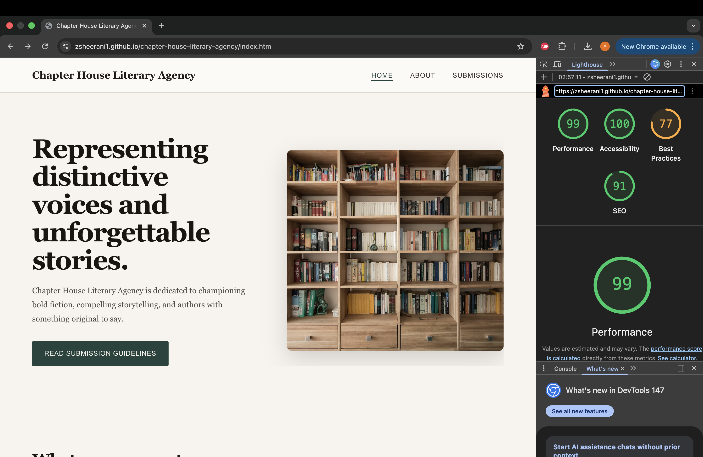

#### Mobile
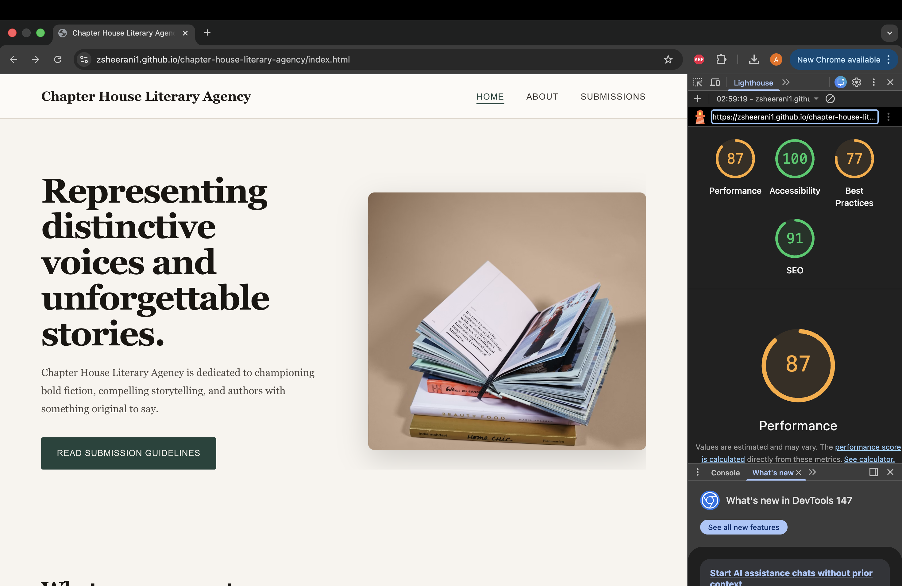

#### About page

#### Desktop
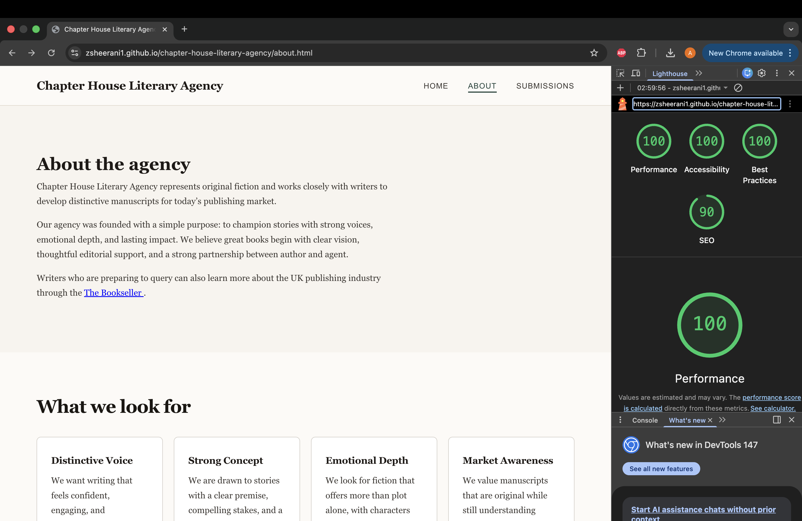

#### Mobile
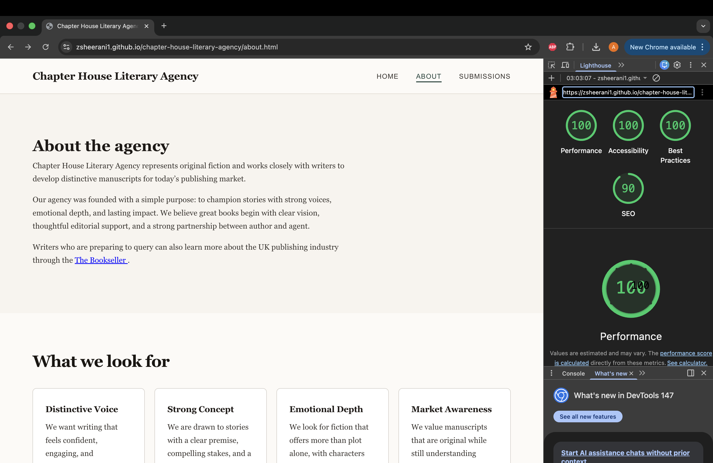


#### Submissions page

#### Desktop
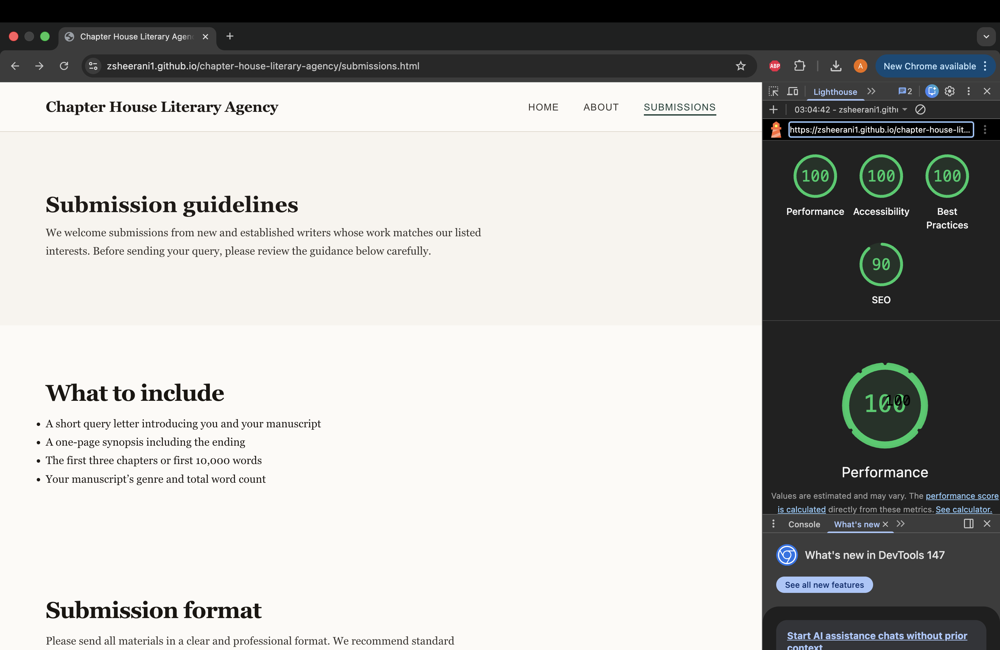

#### Mobile


### Bugs

#### Fixed Bugs

**Slideshow image overflowing the hero section**  
The slideshow image stretched beyond the intended hero layout and disrupted the two-column composition. This was fixed by removing the aspect ratio constraint from the slideshow container, assigning it a fixed height, and applying `object-fit: cover` to the images.

**CSS not applying after upload**  
After deployment, the live site briefly showed outdated styling because the browser had cached an older stylesheet. This was resolved by performing a hard refresh and verifying the updated file paths.

**Genre cards blending into the page background**  
The genre cards initially lacked enough visual contrast against the page background. This was fixed by changing the card background to white and increasing the border contrast.

**Slideshow track visible outside the container**  
After replacing JavaScript with a CSS-only slideshow, layout artefacts appeared beneath the slideshow area. This was fixed by applying `overflow: hidden` to the slideshow wrapper and related container elements.

#### Unfixed Bugs

No known unfixed bugs remain at the time of submission. Code was validated on https://validator.w3.org/
---

## Deployment

The project was deployed using GitHub Pages.

### Deployment Steps

1. The project files were pushed to the main branch of the GitHub repository.
2. In the repository, **Settings** was opened.
3. Under **Pages**, the source was set to the `main` branch.
4. GitHub Pages automatically generated the live site.

### Local Deployment

To clone the repository locally:

1. Go to the repository: [chapter-house-literary-agency](https://github.com/zsheerani1/chapter-house-literary-agency)
2. Click the green **Code** button.
3. Copy the HTTPS URL.
4. Open a terminal and run:

```bash
git clone https://github.com/zsheerani1/chapter-house-literary-agency.git
```

5. Open the project folder in code editor.
6. Launch `index.html` in a browser.

---

## Credits

### Content

All written content for the agency was created for this project.

### Images

- Hero image 1, stack of open books: [Unsplash](https://unsplash.com/photos/rymh7EZPqRs)
- Hero image 2, wooden bookshelf: [Unsplash](https://unsplash.com/photos/NIJuEQw0RKg)

Both images are available under the [Unsplash Licence](https://unsplash.com/license).

### Code

All code for the project was written by the developer.

### Acknowledgements

- Code Institute for project structure and assessment context.
- Gateway Qualifications for the qualification framework [file:247].
